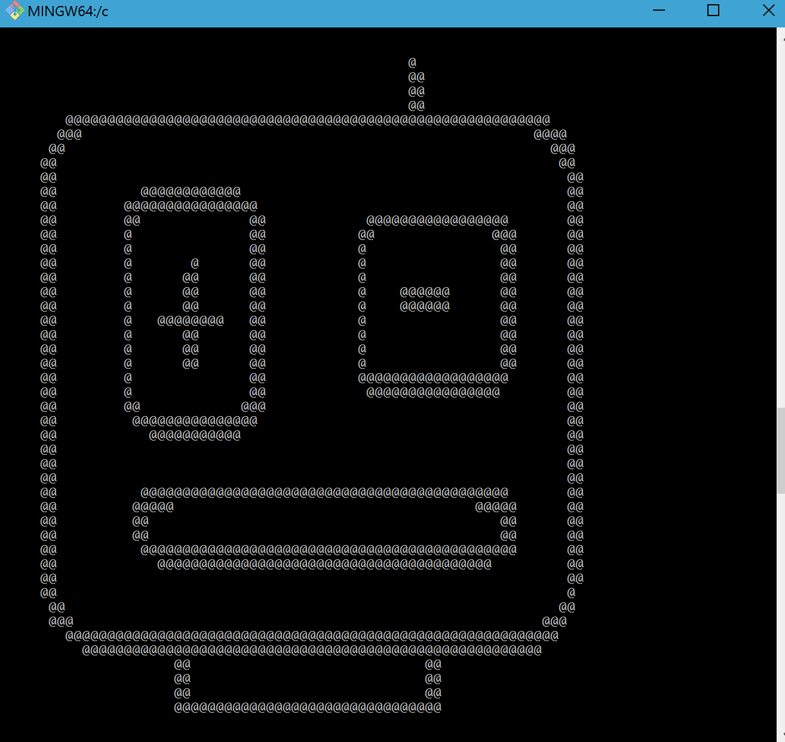
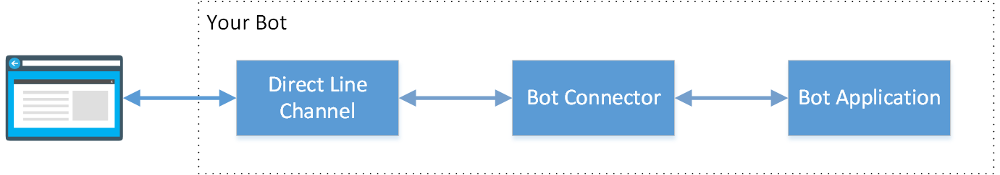

# ng2-botframework-template
Yeoman template for Angular 2 &amp; Microsoft Bot Framework.



----

##Usage (one line)

```npm install --global yo; npm install --global generator-ng2-botframework-template; yo ng2-botframework-template sampleapp; cd sampleapp; npm start;```

To connect the app to your Bot, put your direct line key in app/botframework.service.ts.

##Or (step by step)

1. **Install yeoman** ```npm install --global yo```
2. **Install ng2-botframework-template** ```npm install --global generator-ng2-botframework-template```
4. **Run generator** ```yo ng2-botframework-template <appname>```.  
5. **Start the app** ```cd <appname>; npm start;```

##Introduction

Sets up boilerplate Angular 2 application with connectivity to a Direct Line Bot Framework Channel.  

 